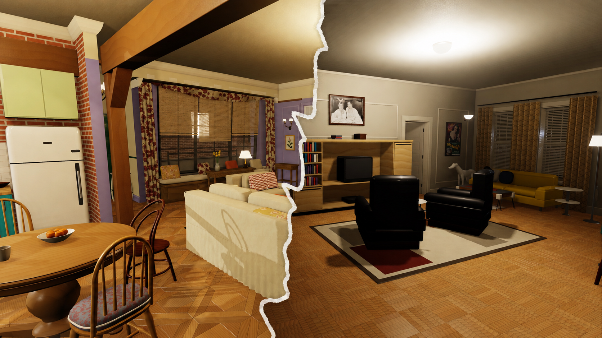

# The One With the Apartments

A procedural Three.js WebGPU recreation of Monica's apartment 20 and Joey and Chandler's apartment 19 from *Friends*. Choose an apartment, then use WASD to walk, the mouse to look, and Escape to pause.


**Play Live: *https://friends3.scottsun.io***

## Requirements

- A desktop Chromium-based browser with WebGPU support
- Node.js and npm

## Development

```sh
npm install
npm run dev
npm run lint
npm run typecheck
npm run build
```
